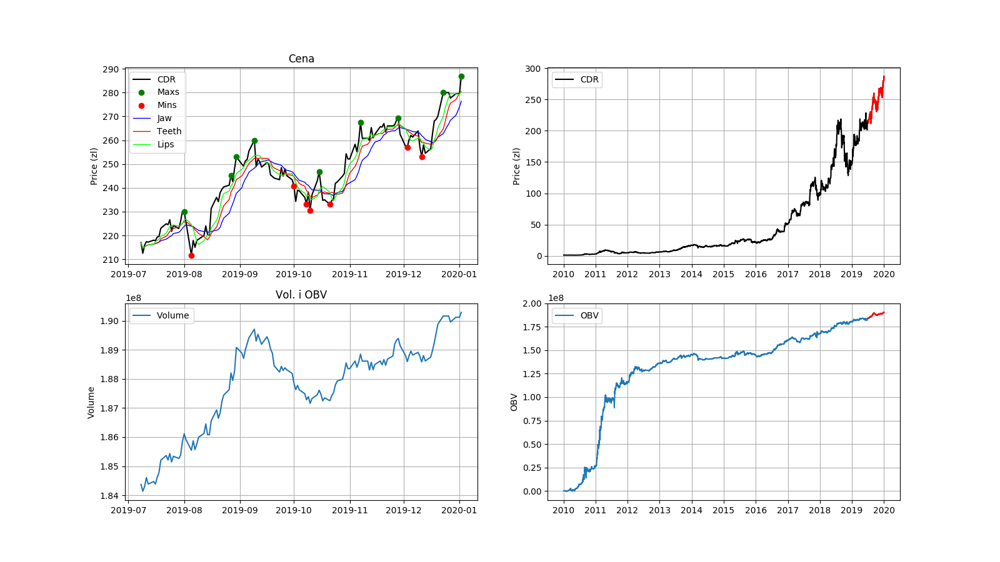

# pyStock
Stock market analyzer and alarams.

# Installation 

# Usage

## Stock viewer.

```bash
usage: stock-viewer.py [-h] -n STOCKCODE [-d BEGINDATE] [-a AVERAGEDAYS] [-Y]
                       [-M] [-W] [-g]

optional arguments:
  -h, --help            show this help message and exit
  -n STOCKCODE, --stockCode STOCKCODE
                        Stock name code
  -d BEGINDATE, --beginDate BEGINDATE
                        Begin date
  -a AVERAGEDAYS, --averageDays AVERAGEDAYS
                        Day to calc mean
  -Y, --lastYear        Last Year
  -M, --lastMonth       Last Month
  -W, --lastWeek        Last Week
  -g, --plotToFile      Plot to file
```

Last year of apple 
```bash
./stock-viewer.py -n AAPL.US -Y
```

Plot Apple last 6M to file
```bash
./stock-viewer.py -n AAPL.US -6M -g
```

Example CD Projekt Red plot
```bash
 ./stock-viewer.py -n CDR -6M -g
```



## Stock alarms

```bash
usage: stock-alarms.py [-h] [-a] [-d] [-c] [-p] [-n STOCKCODE]
                       [-r REFERENCEPRICE] [-t TYPE] [-v VALUE] [-W]

optional arguments:
  -h, --help            show this help message and exit
  -a, --addAlarm        Adds given alarm
  -d, --deleteAlarm     Removes alarm
  -c, --checkAlarms     Check all alarms
  -p, --printAlarms     Print all alarms
  -n STOCKCODE, --stockCode STOCKCODE
  -r REFERENCEPRICE, --referencePrice REFERENCEPRICE
  -t TYPE, --type TYPE
  -v VALUE, --value VALUE
  -W, --lastWeek        Last Week
```


## Problems with pandas_datareader
Info about
https://stackoverflow.com/questions/53097523/importing-data-from-stooq-with-pandas-datareader-returns-empty-dataframe-in-pyth

# TODO
- config .json z wykresami (kod stooq / kod bankier) - rozbudowania sterowania generowania wykresów i porównania akcji,
- Dodanie tekstowych statystyk i informacji pod wykresami,
- timery i serwisy do systemctl,
- config .json z aktywami,
- Alarmy : 
 -- aktywny i nieaktywne alarmy,
 -- pokazywanie alarmów,
- Wysyłanie emaili,
- Sprawdzanie najnowszych raportów dla inwestorów,
- Monitorowanie trendów oraz alarmy z trendów,

