[](https://travis-ci.com/folkien/pyStock)


pyStock - repository of stock analyze, alarm and follow tools.
-------------
pyStock is a bunch of tools used for stock market analyze, follow, and alarms.
* stock-alarms - tool for setting stock alarms and notifiyng user about alarms.
* stock-viewer - tool for generating stock plots and text reports for given stock code. Diffrent plot options, volume, MACD, Williams indicator or RSI.
* stock-viewer-manager - tool manager which can send emails with stock reports, generates reports and plots using stock-viewer. Configurable via json settings files.

# Installation
(Linux) To install all commands and systemd timers and services run script.
```
./install.sh
```

(Other OS) No installation tool provided.

# Configuration

All stock tools are configured through .json files inside config/ directory.

* config/alarms.json - all set followe alarams,
* config/assets.json - wallet of currently bought/sold assets,
* config/recipients.json - email addresses of recipents,
* config/viewer.json - list of followed stocks, stock-viewer commands executed
by stock manager

# Usage

## Systemd services

There are two services with timers.

* daily reports,

```shell
StockDaily.service
StockDaily.sh
StockDaily.timer
```

* weekly reports

```shell
StockWeekly.service
StockWeekly.sh
StockWeekly.timer
```

Services execute stock-manager.

## E-mails sending

Stock-manager can send emails :

* **daily email** - with buy signals for followed stocks and with all signals for
stocks that exists in assets jsons.
* **weekly email** - with plots, signals for all followed stocks.

**Emails from stock-manager are send through linux command `mutt`.** Please install this command and configure it with your local
email server or with your email mailbox. You can use install & configuration script from here
[Link to .sh script from github](https://github.com/folkien/scripts/blob/master/packages/ubuntu-packages/ssmtp-gmail.sh)


## Stock viewer.

Viewer/Plotter tool. Features :
* Plots/Oscillators,
    * Close price - linear,
    * Close price - candlestick OHLC,
    * Volume,
    * OBV,
    * MoneyFlow,
    * Chaikin money flow,
    * Chaikin Oscillator,
    * MACD & MACD Histogram,
    * RSI,
    * CCI,
    * ATR,
    * ADX,
    * Williams alligator,
    * Bollinger,
* Save plots to files \*.svg
* Generates daily/weekly report.md with some usefull informations,

```bash
usage: stock-viewer.py [-h] -n STOCKCODE [-d BEGINDATE] [-a AVERAGEDAYS] [-Y]
                       [-6M] [-M] [-W] [-g] [-r]

optional arguments:
  -h, --help            show this help message and exit
  -n STOCKCODE, --stockCode STOCKCODE
                        Stock name code
  -d BEGINDATE, --beginDate BEGINDATE
                        Begin date
  -a AVERAGEDAYS, --averageDays AVERAGEDAYS
                        Day to calc mean
  -Y, --lastYear        Last Year
  -6M, --last6Months    Last 6 Months
  -M, --lastMonth       Last Month
  -W, --lastWeek        Last Week
  -g, --plotToFile      Plot to file
  -r, --reports         Generate extra reports
```

### Examples

Plot Apple last 6M to file
```bash
./stock-viewer.py -n AAPL.US -6M -g
```

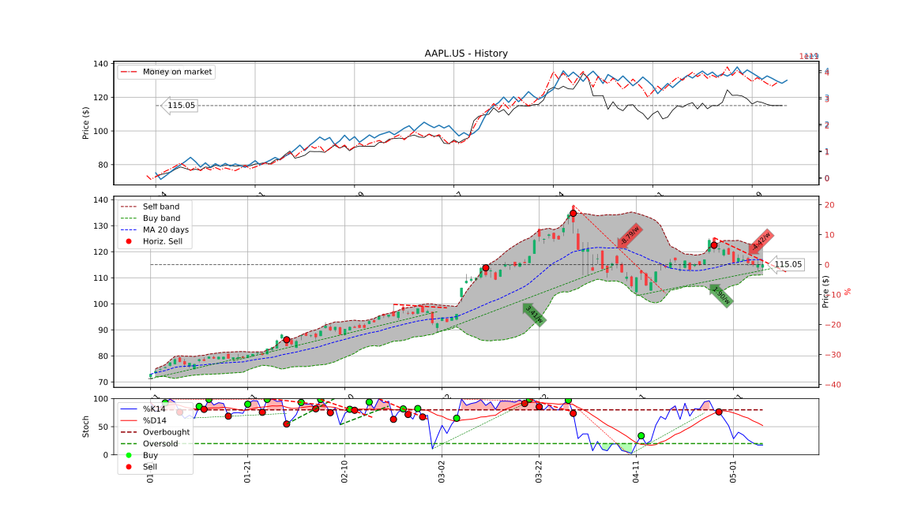
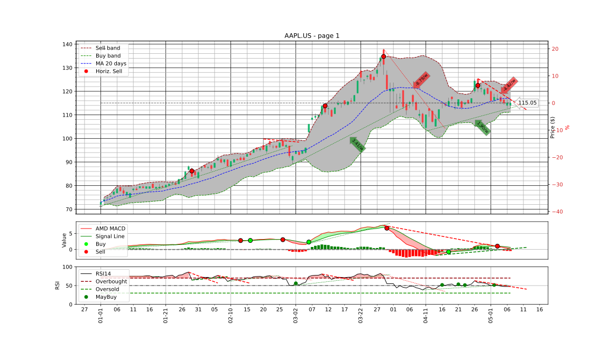
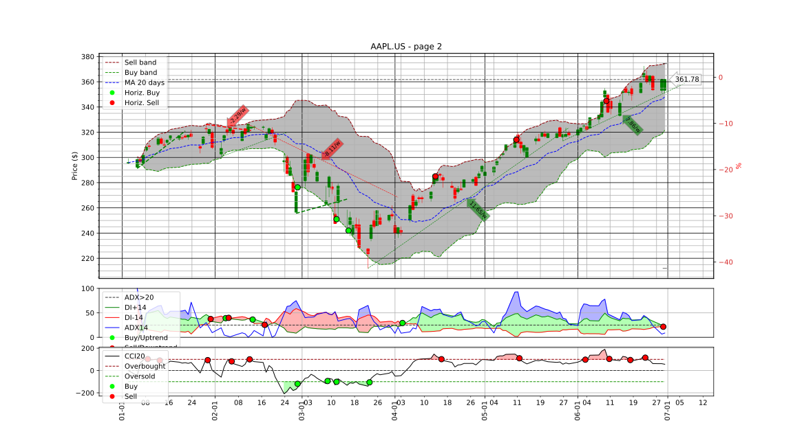
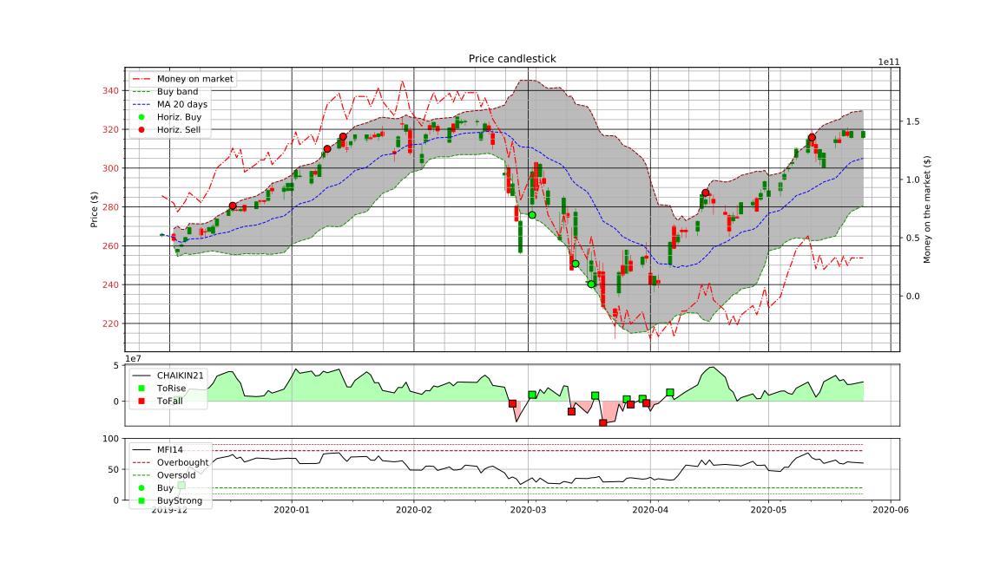

Plot BTC/USD last 6M to file (no volume indicators)
```bash
./stock-viewer.py -n BTCUSD.pl -6M -g
```

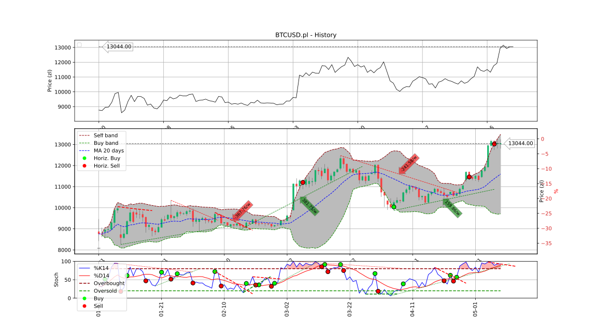
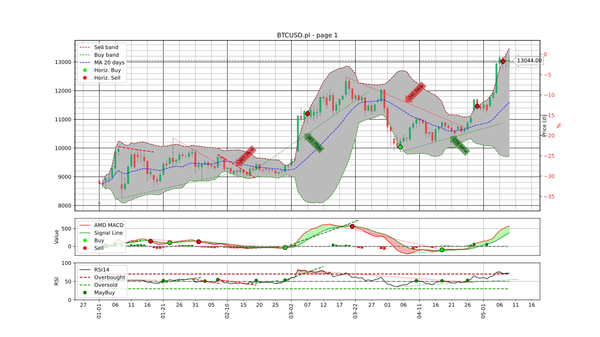
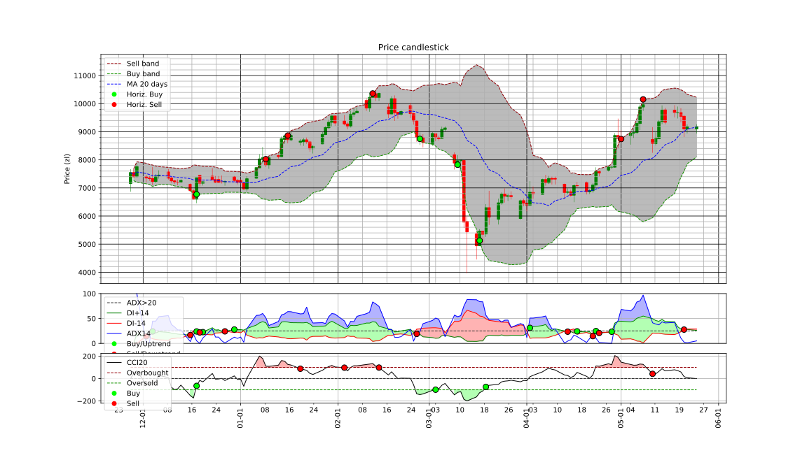
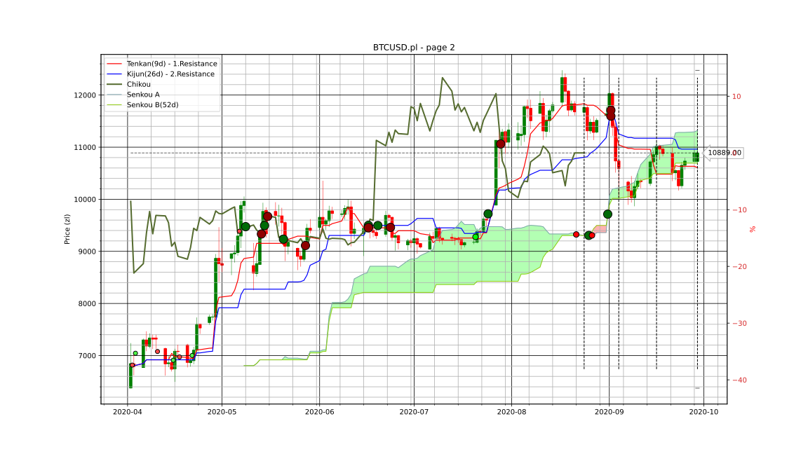

Last year of google with markdown reports into report.md
```bash
./stock-viewer.py -n GOOG.US -Y -r
```
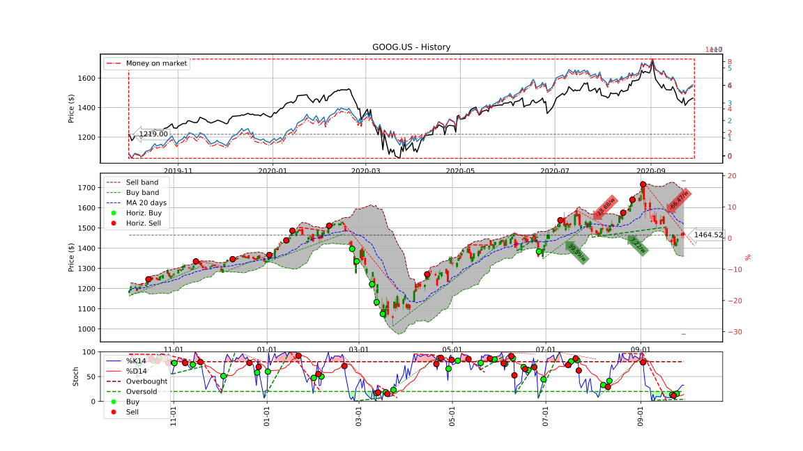
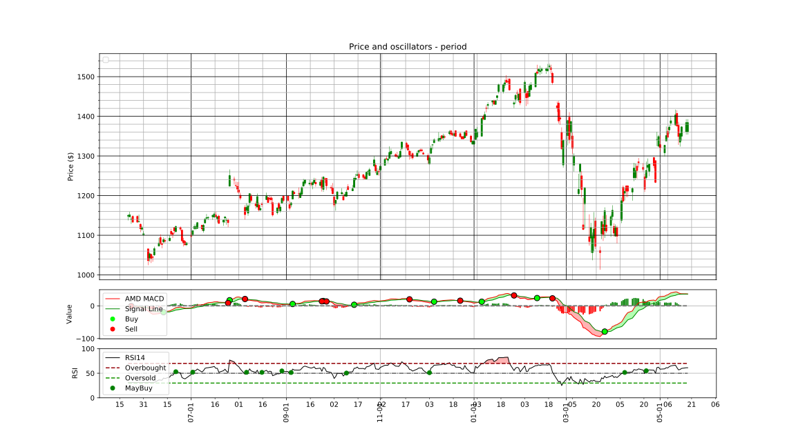
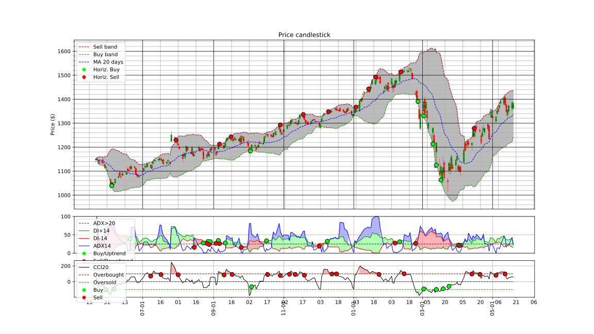
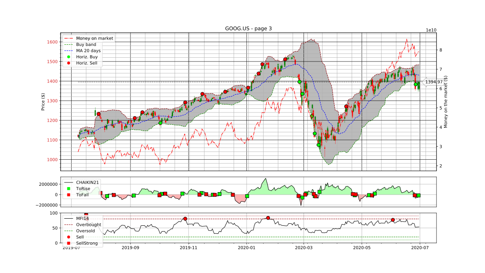

Markdown report
```markdown
# Report for GOOG.us.
1. Price **1455.84zl** - (**97%** of history,                  growth chance <span style='color:green'>+2%</span>,                  lost chance <span style='color:red'>-66%</span>)
    * Current - **1036.23zl - 1486.65zl**
    * History - **492.55zl - 1486.65zl**
    * Volume chng. (2 weeks) - med. **1345387.50**, max **+2396215.00**, min **-1784644.00**


# Report for GOOG.us.
1. Price **1455.84zl** - (**97%** of history,                  growth chance <span style='color:green'>+2%</span>,                  lost chance <span style='color:red'>-66%</span>)
    * Current - **1036.23zl - 1486.65zl**
    * History - **492.55zl - 1486.65zl**
    * Volume chng. (2 weeks) - med. **1345387.50**, max **+2396215.00**, min **-1784644.00**


```

Example CD Projekt Red plot
```bash
 ./stock-viewer.py -n CDR.pl -6M -g
```

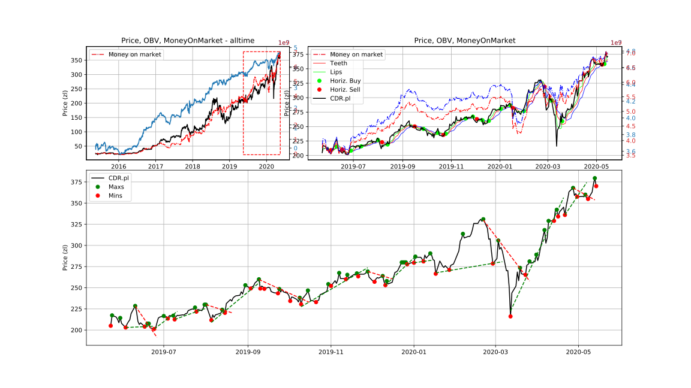
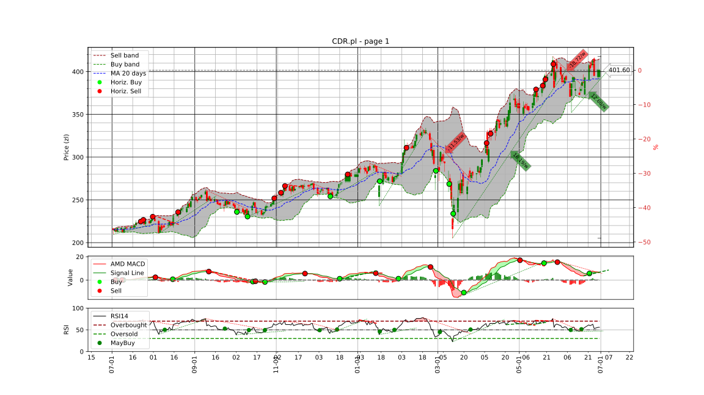
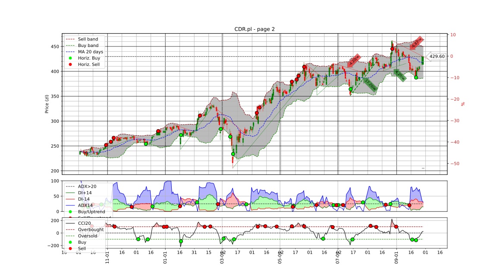
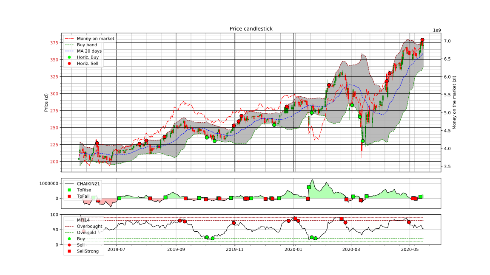


## Stock manager

Features :
* Generates plots(via stoc-viewer) for all configured stock codes
* Generates report for all configured stock codes with extra HTML informations about news,
* Sends emails to cofnigured recipents

```bash
usage: stock-viewer-manager.py [-h] [-a] [-d] [-e] [-s] [-ar ADDRECIPIENT]
                               [-an ARGUMENTS] [-au URL]

optional arguments:
  -h, --help            show this help message and exit
  -a, --add             Adds given
  -d, --delete          Remove
  -e, --execute         Execute
  -s, --show            Print
  -ar ADDRECIPIENT, --addRecipient ADDRECIPIENT
                        Add email recipient
  -an ARGUMENTS, --arguments ARGUMENTS
                        Arguments
  -au URL, --url URL    Bankier URL
```

## Stock alarms

```bash
usage: stock-alarms.py [-h] [-a] [-d] [-c] [-p] [-n STOCKCODE]
                       [-r REFERENCEPRICE] [-t TYPE] [-v VALUE] [-W]

optional arguments:
  -h, --help            show this help message and exit
  -a, --addAlarm        Adds given alarm
  -d, --deleteAlarm     Removes alarm
  -c, --checkAlarms     Check all alarms
  -p, --printAlarms     Print all alarms
  -n STOCKCODE, --stockCode STOCKCODE
  -r REFERENCEPRICE, --referencePrice REFERENCEPRICE
  -t TYPE, --type TYPE
  -v VALUE, --value VALUE
  -W, --lastWeek        Last Week
```

## Stock REST Client

### Installation

The simplest way is to install using Docker

1. Intall Docker https://docs.docker.com/get-docker/

2. Open terminal inside repository location and type:

   ```
    docker build -t example_docker_image_name .
   ```

   This command will create docker image with pyStock REST client.

   You can change  example_docker_image_name with your own docker image name. The '.' at the end is important.

3. Next type:

   ```
   docker run --rm -p 5000:5000 example_docker_image_name
   ```

   This will create and run container based on example_docker_image_name image.

   The client will be listening on port 5000 on host machine.

### REST API

1. #### Get Stock Data

   ##### Request

   ```
   GET /stockdata/<string:stock_code>/<string:stock_index>?begin_date=<example_begin_date>&end_date=<example_end_date>
   //example http://localhost:5000/stockdata/AAPL.US/Close?begin_date=2016-01-01&end_date=2016-01-10
   ```

   stock_code - String with stock code for example AAPL.US (Apple stock code), ELZ (Elzab stock code)

   stock_index - one of the following:

   1. Close - Close price
   2. High - Highest price
   3. Low - Lowest price
   4. Money - ?
   5. OBV - On Balance Volume
   6. Typical - typical price
   7. Volume - trading volume
   8. VolumeN - ?
   9. VolumeP - ?

   example_begin_date - begin date in ISO format YYYY-MM-DD

   example_end_date - end date in ISO format YYYY-MM-DD

   ##### Response

   ```json
   //example
   {"Close":
    {"2016-01-05T00:00:00.000Z":95.494,
     "2016-01-06T00:00:00.000Z":93.624,
     "2016-01-07T00:00:00.000Z":89.674,
     "2016-01-08T00:00:00.000Z":90.148}
   }
   ```

   

# License

MIT License

# Bibliography
* https://www.edukacjagieldowa.pl/gieldowe-abc/analiza-techniczna/
* https://money.stackexchange.com/questions/tagged/stocks
* https://www.investopedia.com/terms/m/macd.asp
* https://en.wikipedia.org/wiki/MACD
* https://en.wikipedia.org/wiki/Relative_strength_index
* https://www.investopedia.com/terms/r/rsi.asp
